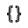

[

# node-red-contrib-iiot-jwt
The JSON Web Token (JWT) toolbox package for Node-RED.

* v1.x is now LTS version until Oktober 2019 (branch 1.0)
* based on jsonwebtoken library v8.x

**If you like that contributor's package for Jolt, then please give us your star at GitHub**

### Jolt Version

Jolt 0.1.6

## Install

Run command on Node-RED installation directory.

	npm install node-red-jolt 

or run command for global installation.

	npm install -g node-red-jolt

try these options on npm install to build, if you have problems to install

    --unsafe-perm --build-from-source
   
### License

The MIT License

[Klaus Landsdorf][1]

### Important

This is **not** an official product of the Jolt.
It is just to provide Jolt to Node-RED based on jsonwebtoken package.